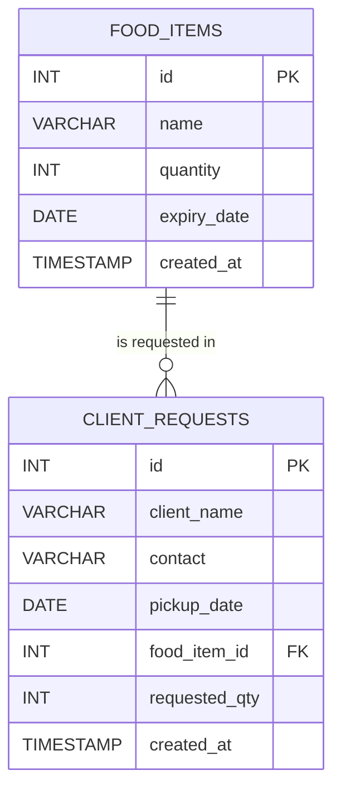

# PantryFlow - Database Schema

## 1. Design Goal

The database supports the assessment's required inventory and request functions with the smallest rubric-aligned relational model. One client request contains one selected food item and one requested quantity.

## 2. Entity Relationship

The implemented schema has one genuine relationship: one `food_items` row may be referenced by zero or many `client_requests` rows, while each request references exactly one food item. This is intentional rather than an omitted entity. The assessment requires a hardcoded administrator account and PHP Session authentication, so an `admins` or `users` table would contradict the implemented scope.



## 3. Data Dictionary

### 3.1 `food_items`

| Column | Type | Null | Key / Default | Rule |
|---|---|---:|---|---|
| `id` | `INT UNSIGNED` | No | PK, auto increment | Stable item identifier. |
| `name` | `VARCHAR(100)` | No | Indexed | Trimmed, non-empty item name. |
| `quantity` | `INT UNSIGNED` | No | Default `0`, indexed | Cannot be negative. Low stock is below 5. |
| `expiry_date` | `DATE` | Yes | Indexed | `NULL` means no expiry date supplied. |
| `created_at` | `TIMESTAMP` | No | Current timestamp | Audit information for item creation. |

### 3.2 `client_requests`

| Column | Type | Null | Key / Default | Rule |
|---|---|---:|---|---|
| `id` | `INT UNSIGNED` | No | PK, auto increment | Stable request identifier. |
| `client_name` | `VARCHAR(100)` | No | None | Trimmed, non-empty client name. |
| `contact` | `VARCHAR(30)` | No | None | Stored as text to preserve `+`, spaces, and leading zeros. |
| `pickup_date` | `DATE` | No | Indexed | Must be later than today; enforced by PHP. |
| `food_item_id` | `INT UNSIGNED` | No | FK, indexed | References `food_items.id`. |
| `requested_qty` | `INT UNSIGNED` | No | None | Positive integer validated against current stock. |
| `created_at` | `TIMESTAMP` | No | Current timestamp | Submission time. |

## 4. Baseline DDL

The later `database/schema.sql` implementation shall follow this baseline.

```sql
CREATE DATABASE IF NOT EXISTS pantryflow
  CHARACTER SET utf8mb4
  COLLATE utf8mb4_unicode_ci;

USE pantryflow;

CREATE TABLE food_items (
    id INT UNSIGNED AUTO_INCREMENT PRIMARY KEY,
    name VARCHAR(100) NOT NULL,
    quantity INT UNSIGNED NOT NULL DEFAULT 0,
    expiry_date DATE NULL,
    created_at TIMESTAMP NOT NULL DEFAULT CURRENT_TIMESTAMP,
    INDEX idx_food_items_name (name),
    INDEX idx_food_items_quantity (quantity),
    INDEX idx_food_items_expiry_date (expiry_date)
) ENGINE=InnoDB;

CREATE TABLE client_requests (
    id INT UNSIGNED AUTO_INCREMENT PRIMARY KEY,
    client_name VARCHAR(100) NOT NULL,
    contact VARCHAR(30) NOT NULL,
    pickup_date DATE NOT NULL,
    food_item_id INT UNSIGNED NOT NULL,
    requested_qty INT UNSIGNED NOT NULL,
    created_at TIMESTAMP NOT NULL DEFAULT CURRENT_TIMESTAMP,
    INDEX idx_requests_food_item (food_item_id),
    INDEX idx_requests_pickup_date (pickup_date),
    CONSTRAINT fk_requests_food_item
        FOREIGN KEY (food_item_id)
        REFERENCES food_items (id)
        ON UPDATE CASCADE
        ON DELETE RESTRICT
) ENGINE=InnoDB;
```

## 5. Required Sample Data States

The schema file shall insert at least five sample items. To demonstrate the rubric clearly, the dataset should contain all of these states:

| State | Example |
|---|---|
| Normal stock with future expiry | Rice, quantity 20 |
| Normal stock without expiry | Canned Beans, quantity 12, `NULL` expiry |
| Low stock | Cooking Oil, quantity 4 |
| Expired but still recorded | Milk Powder, past expiry date |
| Out of stock | Pasta, quantity 0 |
| Additional requestable item | Oatmeal, quantity 8 |

Use dates that will still demonstrate the intended state during assessment. An expired sample should use a clearly past fixed date; future samples should use a date after the assessment period.

## 6. Core Query Rules

### Public Inventory

- Display all items so expired and out-of-stock states remain visible.
- Calculate status in PHP or SQL from `quantity` and `expiry_date`.

### Request Dropdown

```sql
SELECT id, name, quantity, expiry_date
FROM food_items
WHERE quantity > 0
  AND (expiry_date IS NULL OR expiry_date >= CURRENT_DATE)
ORDER BY name;
```

### Administrator Request List

```sql
SELECT
    cr.id,
    cr.client_name,
    cr.contact,
    cr.pickup_date,
    cr.requested_qty,
    cr.created_at,
    fi.name AS food_item_name
FROM client_requests AS cr
JOIN food_items AS fi ON fi.id = cr.food_item_id
ORDER BY cr.created_at DESC;
```

### Low-Stock List

```sql
SELECT id, name, quantity, expiry_date
FROM food_items
WHERE quantity < 5
ORDER BY quantity ASC, name ASC;
```

## 7. Transaction Rule for Request Processing

The server shall process a valid request using this logical sequence:

1. Start a PDO transaction.
2. Select the chosen item using its ID and lock the row for update.
3. Re-check existence, expiry, requested quantity, and current stock.
4. Insert one `client_requests` row.
5. Decrement inventory using a guarded update such as `quantity >= :requested_qty`.
6. Confirm that exactly one inventory row was updated.
7. Commit on success; roll back on validation failure or exception.

This protects the invariant:

```text
food_items.quantity >= 0
```

## 8. Intentional Simplification

A production system that permits several items in one request would normally use `requests` and `request_items` tables. This prototype intentionally follows the assessment's two-table model and dynamic single-item dropdown. Multi-item requests are out of scope unless the lecturer explicitly changes the requirement.
