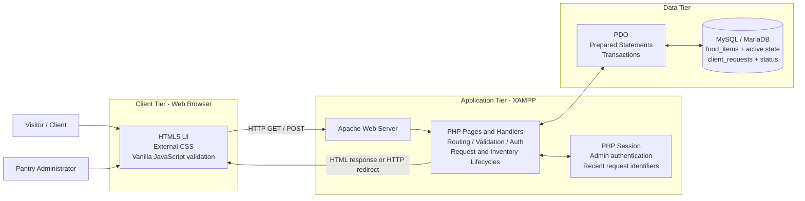
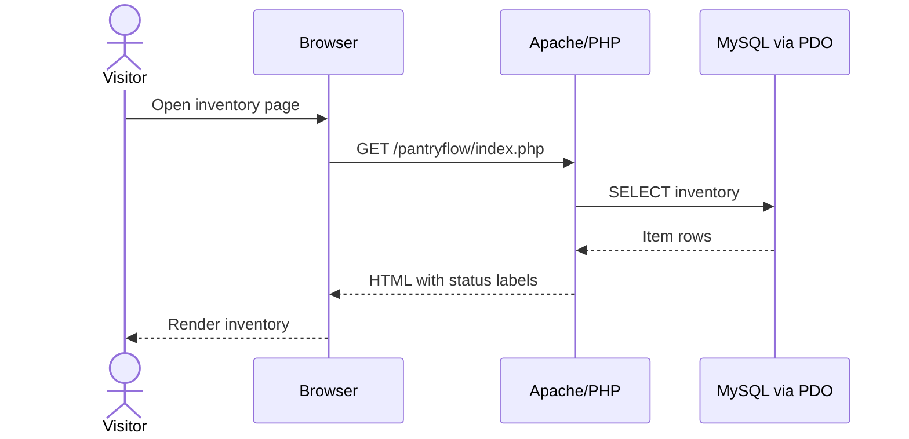
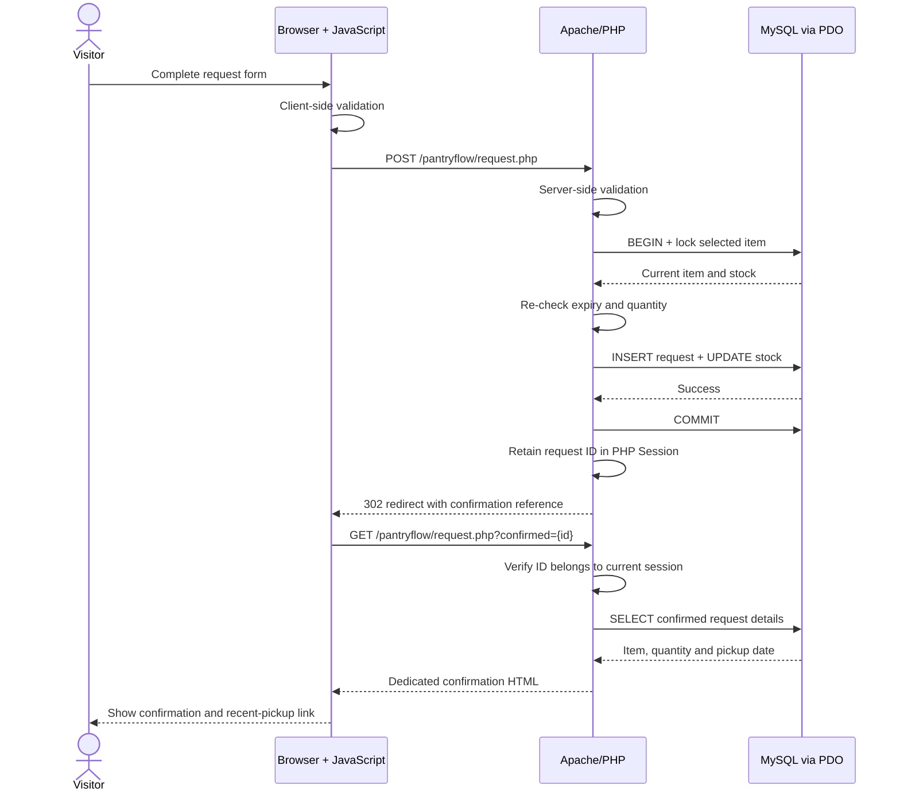
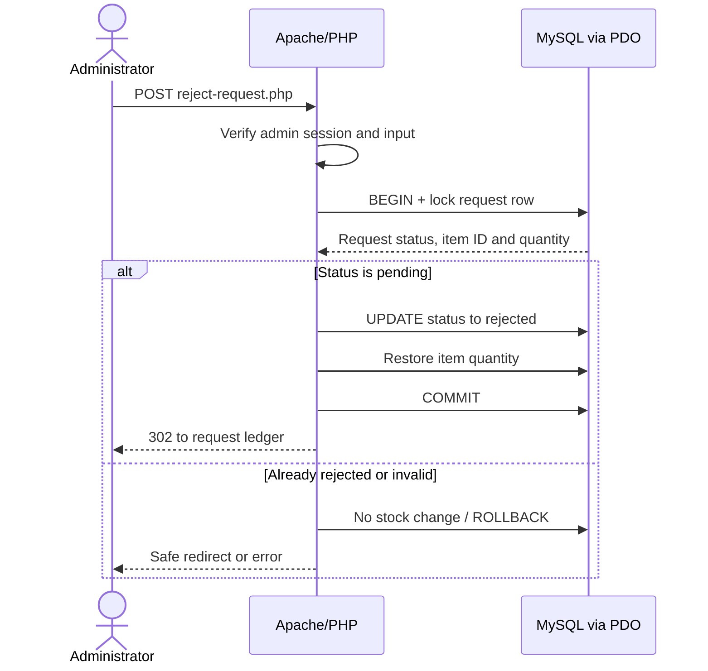
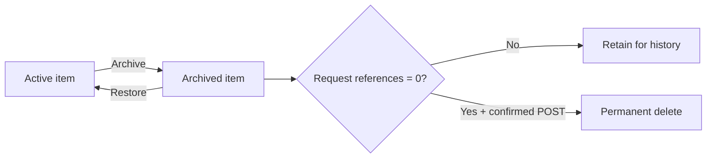
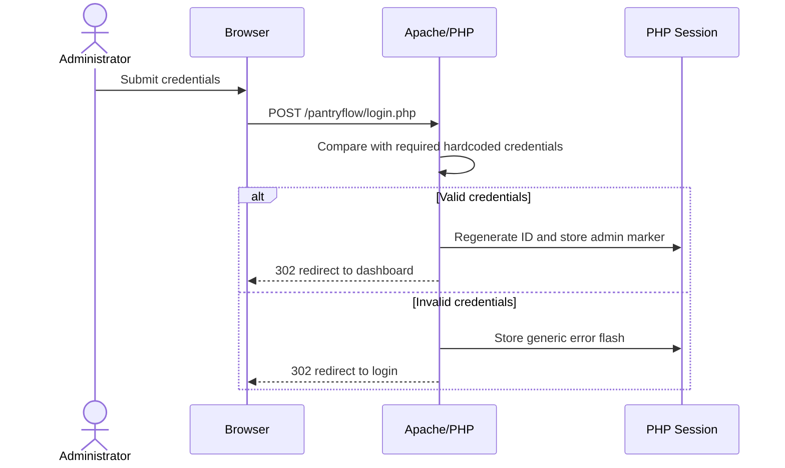

# PantryFlow - System Architecture

## 1. Architecture Style

The application uses a small three-tier client-server architecture:

1. **Presentation tier:** HTML, CSS, and vanilla JavaScript in the browser.
2. **Application tier:** Apache and PHP in XAMPP.
3. **Data tier:** MySQL / MariaDB accessed through PDO.

The browser improves usability but is not trusted to enforce business rules. PHP is the authority for authentication, validation, security, and inventory updates. MySQL is the persistent source of truth.

## 2. System Architecture Diagram



## 3. Responsibilities by Layer

| Layer | Responsibilities | Must Not Be Trusted For |
|---|---|---|
| Browser | Render pages, responsive styling, form controls, immediate JS validation. | Final validation, authorisation, or stock decisions. |
| Apache/PHP | Route requests, validate all input, authenticate admin, apply business rules, escape output, manage PRG, transactions, and lifecycle transitions. | Persistent storage without the database. |
| PDO | Manage database connection, prepared statements, transactions, and exception behaviour. | Presentation or user-facing error text. |
| MySQL / MariaDB | Persist inventory, active/archive state, requests, request status, and PK/FK relationships. | Browser-side interaction or session state. |

## 4. Planned Route and Component Map

| Route / File | Method | Access | Responsibility |
|---|---|---|---|
| `index.php` | GET | Public | Display complete inventory and status labels. |
| `request.php` | GET | Public | Display the request form or a session-owned confirmation. |
| `request.php` | POST | Public | Validate, store request, decrement stock, redirect. |
| `history.php` | GET | Public | Display database-backed confirmations whose identifiers belong to the current session. |
| `login.php` | GET | Public | Display login form and authentication feedback. |
| `login.php` | POST | Public | Validate hardcoded admin credentials and redirect. |
| `dashboard.php` | GET | Admin | Display request status/actions, low stock, complete inventory, and add-item UI. |
| `add-item.php` | POST | Admin | Validate and insert a food item, then redirect. |
| `reject-request.php` | POST | Admin | Atomically reject a pending request and restore reserved stock. |
| `inventory-action.php` | POST | Admin | Archive, restore, or safely delete an unreferenced archived item. |
| `logout.php` | POST preferred | Admin | Clear authentication state and redirect to login. |
| `config/pdo.php` | Internal | Internal | Create configured PDO connection. |
| `includes/auth.php` | Internal | Internal | Start session and enforce admin access. |
| `includes/functions.php` | Internal | Internal | Shared escaping, redirect, flash, and validation helpers. |

The final implementation may combine a simple POST handler with its corresponding page, but route responsibilities and security boundaries must remain unchanged.

## 5. Public Inventory Request Flow



## 6. Client Request Submission Flow



If validation or a database step fails, PHP rolls back the transaction, stores a safe error message, and redirects without changing data.

## 7. Administrator Lifecycle Flows

### 7.1 Reject a Pending Request



### 7.2 Inventory Record Lifecycle



Archived records remain in MySQL and in historical request joins, but public inventory and request-selection queries include `is_active = 1` only.

## 8. Administrator Authentication Flow



Every protected route checks session authentication before output or database modification. Logout removes the administrator authentication state and redirects; anonymous recent-request identifiers may remain because they grant no administrator access.

## 9. Security Boundaries

- Browser validation is a usability feature; PHP repeats every validation.
- External values are bound to prepared statements rather than concatenated into SQL.
- Values rendered into HTML are escaped at output time.
- Administrator authorisation is checked on every protected request, including POST handlers.
- Public confirmation identifiers are checked against the current session before request details are queried.
- Recent pickup pages omit client name and contact number.
- Database exceptions are handled internally; only safe messages are shown to users.
- Data-changing requests use POST and POST-Redirect-GET.
- Every request and inventory lifecycle handler repeats the administrator session guard.
- Destructive or stock-restoring actions require a deliberate UI confirmation; PHP and database rules remain authoritative if JavaScript is bypassed.

## 10. Deployment Context

```text
E:\XAMPP\htdocs\pantryflow
        |
        +-- Apache document root mapping
        |
        +-- http://localhost:8080/pantryflow/ (this machine)
        +-- http://localhost/pantryflow/ (standard Apache port 80)

XAMPP Apache/PHP  --->  XAMPP MySQL / MariaDB
```

Expected local configuration:

- Apache and MySQL are started through XAMPP.
- The `pantryflow` database is imported from `database/schema.sql`.
- PDO connection settings are centralised in `config/pdo.php`.
- The application has no runtime internet dependency.

## 11. Architecture Quality Gates

- No database query is executed directly from client-side JavaScript.
- No protected content is rendered before authentication checks.
- No business rule depends only on JavaScript.
- No data-changing operation is performed through GET.
- No external input is concatenated into SQL.
- Request storage and stock decrement are atomic.
- Request rejection and stock restoration are atomic and idempotent.
- Archived items are excluded from public queries without breaking historical foreign-key joins.
- Permanent deletion is limited to archived items with no request references.
- Every redirect occurs before HTML output.

## 12. Related Diagram Deliverables

This document contains the required system architecture and request-response flow. The final report should also include:

1. A sitemap showing all public and administrator pages.
2. The ERD from `05-Database-Schema.md`.
3. An administrator lifecycle flow showing rejection, stock restoration, archive, restore, and guarded deletion.
