# PantryFlow Technical Report Draft

> Replace the bracketed details before converting this report to PDF.

**Student name:** [STUDENT NAME]  
**Student ID:** [STUDENT ID]  
**Module:** Web Application Programming  
**Project:** PantryFlow  
**Demonstration video:** [PASTE SHAREABLE VIDEO LINK HERE]

## 1. Project Introduction

PantryFlow is a small web application for a community food pantry. The public side displays current food stock and lets a client request one available item for a future pickup date. The administrator side is protected by a PHP session and provides a request list, low-stock list and form for adding food items.

The implementation uses plain HTML, CSS and JavaScript in the browser, PHP on the server and MySQL/MariaDB for persistent data. I kept the scope close to the assessment instead of adding unrelated features such as registration, payment or multi-item shopping carts.

## 2. Client-Server Architecture

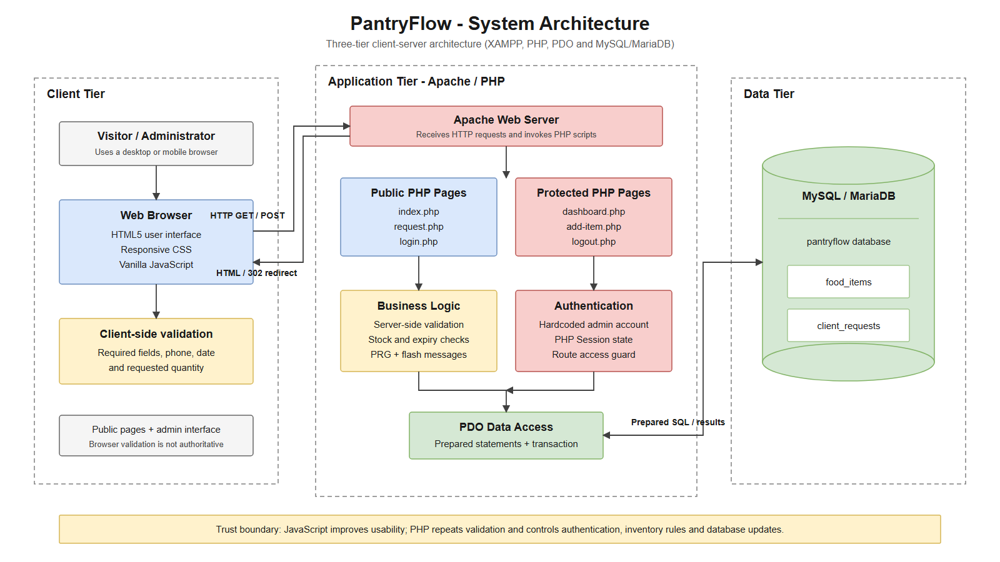

The browser is the client layer. It renders HTML and CSS and runs JavaScript validation on the request form. HTTP requests are sent to Apache, which runs the PHP page or action script. PHP performs the trusted validation and business rules, then uses PDO prepared statements to read or update MySQL. The server returns a complete HTML response or redirects after a successful POST.

This separation matters because browser-side validation improves usability but can be bypassed. PHP therefore validates the same important values again before changing data. MDN also describes client-side validation as a user-experience feature that must not replace server-side checking [4].

## 3. Technology Choices

### HTML and CSS

Semantic HTML is used for navigation, forms, tables, headings and status messages. CSS provides a responsive card layout, visible focus states and text labels as well as colours for item status. The layout works at desktop size and at a tested 390-pixel mobile viewport. The interaction review also followed Vercel's framework-independent Web Interface Guidelines for keyboard access, clear focus, minimum mobile target sizes, helpful errors and complete interface states [7].

### JavaScript

JavaScript updates the maximum request quantity after the user chooses an item and gives immediate field-level messages. It does not write to the database and it is not treated as a security boundary.

### PHP and Sessions

PHP handles routing, validation, authentication and HTML generation. The administrator state is stored in a PHP session [1]. The session ID is regenerated after a successful login, protected pages call a shared guard, and logout is a POST action that removes the authenticated state.

### PDO

PDO keeps the database connection in one configuration file and provides prepared statements. Bound parameters keep user input separate from SQL syntax, which follows the main defence recommended by OWASP for SQL injection [2][5].

### MySQL / MariaDB

The database stores food items and client requests. InnoDB supports foreign keys and transactions. During request processing, PantryFlow locks the chosen food row, checks the latest quantity, inserts the request and decrements stock in one transaction. MySQL documents locking reads as the correct tool when rows will be checked and then updated [3].

## 4. Site Structure

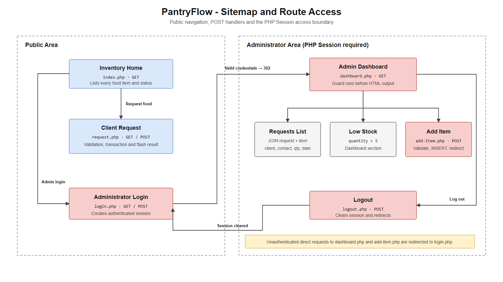

The inventory and request pages are public. The login page creates the administrator session. The dashboard and add-item action require that session. Logout removes the session and protected routes redirect back to login.

Main routes:

- `index.php` — inventory listing and item states.
- `request.php` — request form, validation and transaction.
- `login.php` — hardcoded assessment login.
- `dashboard.php` — requests, low stock and add-item form.
- `add-item.php` — protected POST action.
- `logout.php` — protected POST logout action.

## 5. Database Design

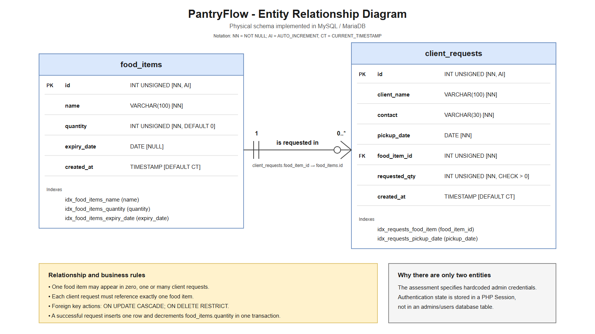

The database deliberately contains two main tables because one client request selects one food item. `food_items.id` is the primary key. `client_requests.food_item_id` is a foreign key, so one food item can be referenced by zero or many request records. `ON DELETE RESTRICT` avoids removing an item that still has request history.

Indexes support the dashboard queries for item names, quantities, expiry dates, request item joins and pickup dates. A check constraint prevents a non-positive requested quantity. Application validation still runs because database constraints are the last safety layer, not the whole user experience.

## 6. Request and Response Flow

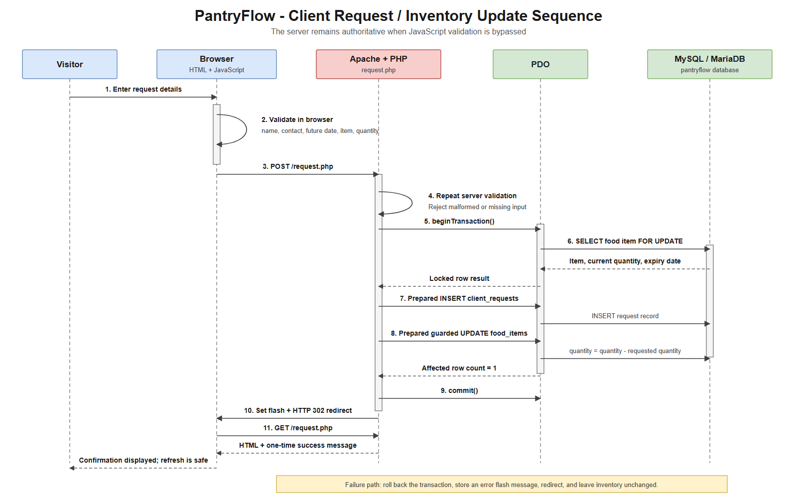

For a successful food request:

1. PHP reads requestable items from MySQL and returns the form.
2. JavaScript checks required fields, contact format, future date and requested quantity.
3. PHP receives the POST and repeats all trusted validation.
4. PHP begins a transaction and selects the chosen item using `FOR UPDATE`.
5. The latest stock and expiry date are checked.
6. A request row is inserted and the stock is decremented with a guarded update.
7. The transaction commits and PHP redirects to a GET page with a success message.

If a check fails, the transaction is rolled back and the user receives an error. The redirect after success prevents accidental duplicate submission when the browser refreshes.

## 7. Validation and Security

The application includes the following controls:

- Required-field, length, format, future-date and quantity checks in PHP.
- Matching browser validation for faster feedback.
- PDO prepared statements for every value received from a user.
- Central `htmlspecialchars` escaping before dynamic values are printed. OWASP recommends context-appropriate output encoding to prevent cross-site scripting [6].
- Session protection for the dashboard and all administrator actions.
- Session ID regeneration after login.
- POST-only add-item and logout actions.
- Database transaction, row lock and guarded stock update to reduce race-condition risk.
- Generic database error messages in the interface while technical details go to the server log.

The administrator credentials are hardcoded because this is an explicit assessment requirement. A production system should store password hashes and administrator accounts in a database or identity service.

## 8. Testing Evidence

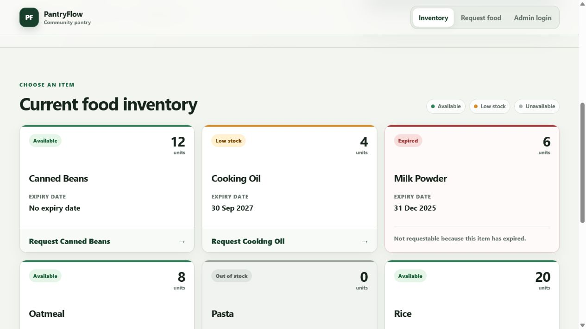

The clean database displays six seed items. The page distinguishes normal, low-stock, out-of-stock and expired states.

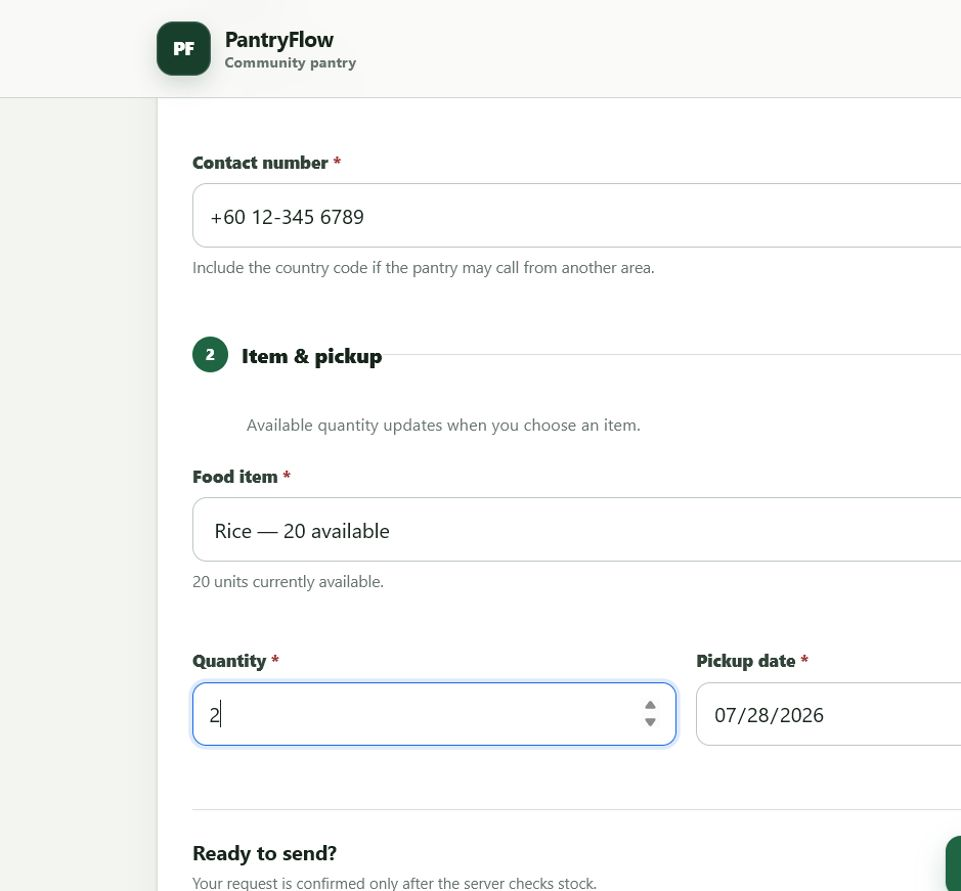

The item dropdown is populated from current stock. JavaScript adjusts the allowed maximum for the selected item.

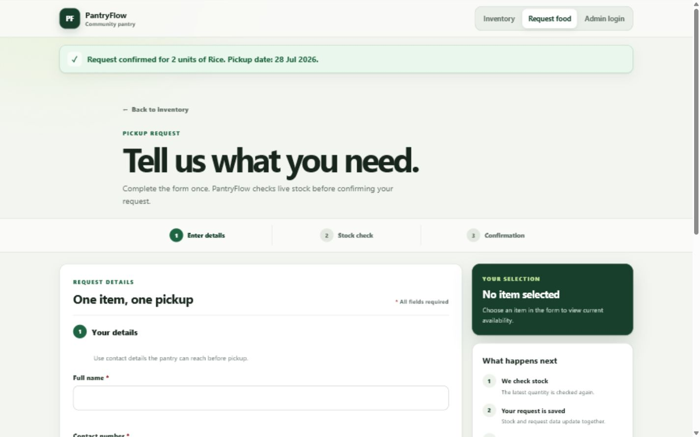

The success message confirms the request and the selected Rice quantity changes from 20 to 18.

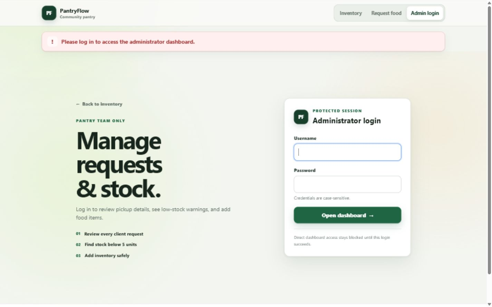

Opening the dashboard without an authenticated session redirects to the login page and explains why access was blocked.

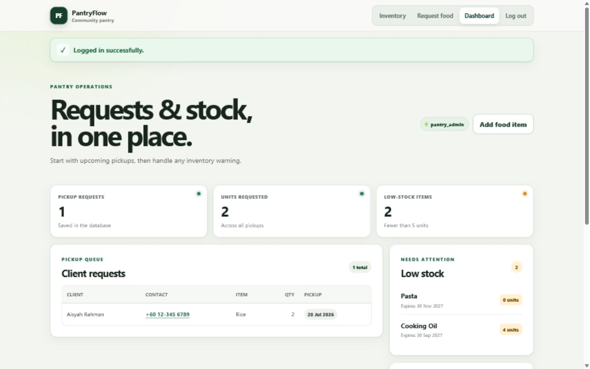

After login, the dashboard displays the saved request, two items below five units and the add-item form.

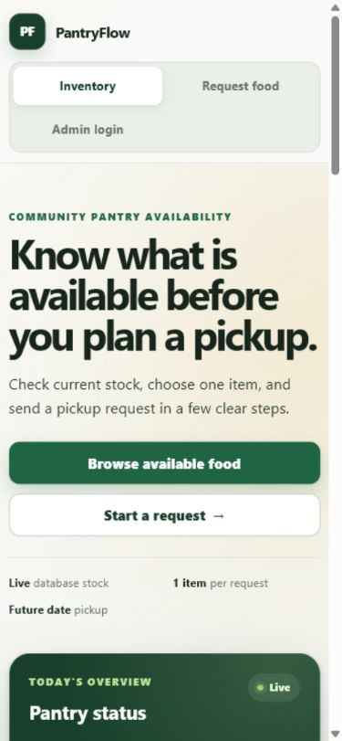

The inventory was checked at a 390-pixel viewport. The measured content width stayed inside the viewport, so there was no horizontal overflow.

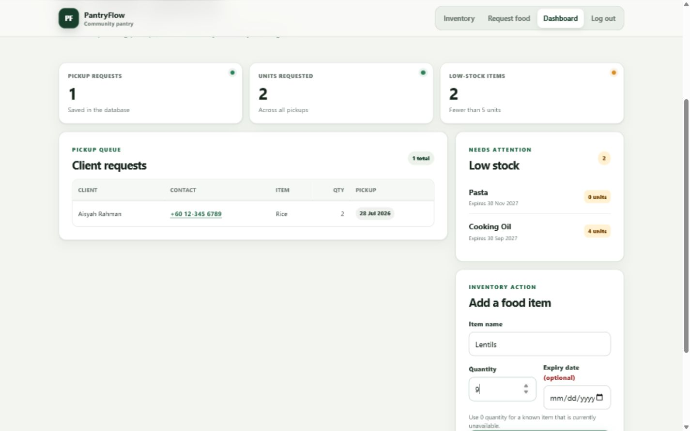

The administrator can jump directly from the dashboard heading to the add-item task. Invalid values return an actionable message and preserve entered values; a valid insert returns a success message and clears the form.

In addition to the visual checks, all PHP files passed syntax checking, the JavaScript file passed a Node syntax check, and ten HTTP/database smoke checks passed. These checks covered valid and invalid requests, authentication, protected routes, SQL-injection-style input, escaped stored text and clean database reset.

## 9. HCI and Interaction Design

The first working interface was technically correct but required too much navigation effort. The revised flow is task-oriented:

- Each requestable inventory card links directly to the form with that item preselected.
- Unavailable cards explain why they cannot be requested instead of showing a dead control.
- The request form groups personal details separately from item and pickup details.
- A live selection summary shows the chosen item and current quantity.
- Inline errors appear after interaction, the first invalid field receives focus on submit, and server validation still decides the result.
- The submit control changes to a busy state to reduce accidental double submission.
- Dashboard summary cards describe useful work counts instead of repeating login state.
- Mobile navigation uses a two-column layout with no hidden horizontal scrollbar.
- Status uses text as well as colour, and native elements provide keyboard and assistive-technology semantics.

## 10. Conclusion

PantryFlow meets the requested public inventory, client request and administrator workflows using a straightforward client-server structure. The most important implementation choice was to treat PHP and the database as the trusted layers while still providing useful feedback in JavaScript. The database remains small, but its relationship and transaction are enough for the stated one-item request scope.

## 11. References

The numbered sources are listed in `docs/11-References.md`. The same list should be copied into the final PDF after this report.
